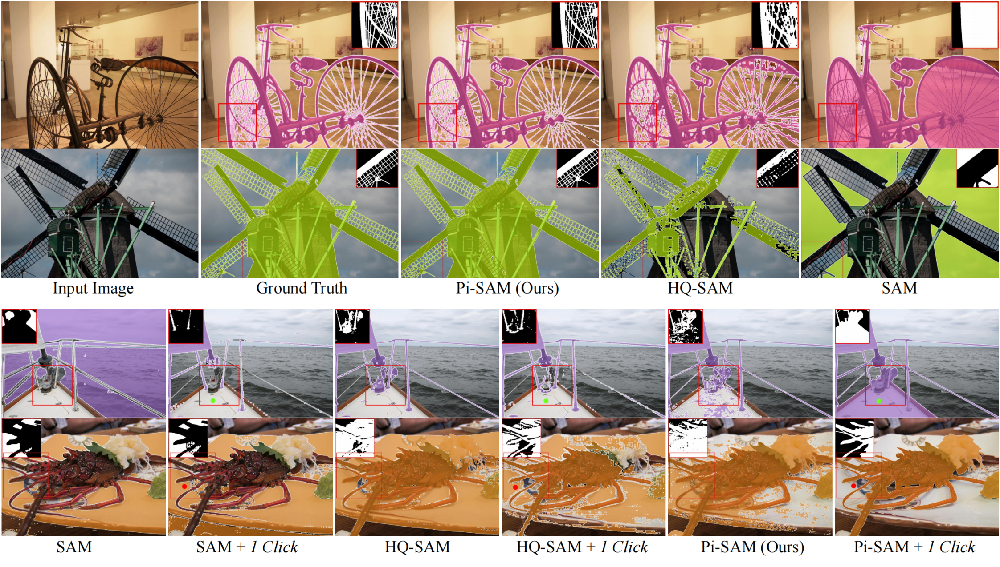
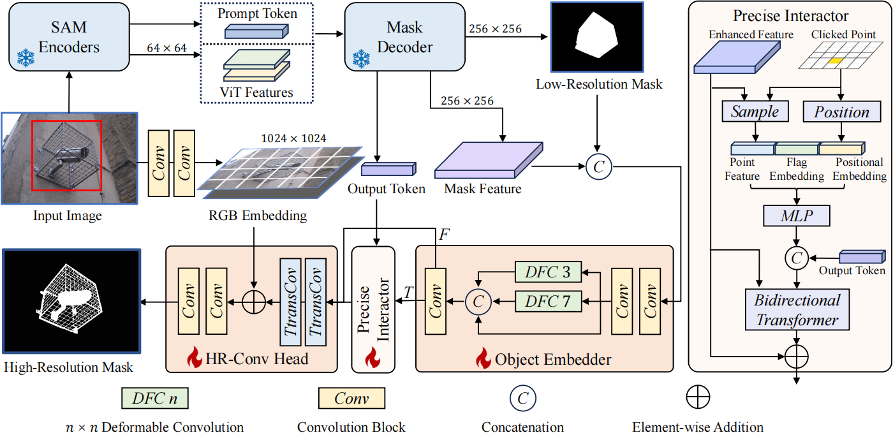

# Segment Anything with Precise Interaction (ACMMM 2024 Oral)

paper link [Segment Anything with Precise Interaction](https://openreview.net/pdf?id=lD9A7SS4BP)


## Introduction



<br>
  Although the Segment Anything Model (SAM) has achieved impressive results in many segmentation tasks and benchmarks, its performance noticeably deteriorates when applied to high-resolution images for high-precision segmentation. We explored transferring SAM into the domain of high-resolution images and proposed Pi-SAM. Compared to the original SAM and its variants, Pi-SAM demonstrates the following superiorities:

  **Firstly**, Pi-SAM possesses a strong perception capability for the extremely fine details in high-resolution images, enabling it to generate high-precision segmentation masks. As a result,Pi-SAM significantly surpasses previous methods in four high-resolution datasets.

  **Secondly**, Pi-SAM supports more precise user interactions. In addition to the native promptable ability of SAM, Pi-SAM allows users to interactively refine the segmentation predictions simply by clicking. While the original SAM fails to achieve this on high-resolution images.

  **Thirdly**, building upon SAM, Pi-SAM introduces very few additional parameters and computational costs and ensures highly efficient model fine-tuning to achieve the above performance.




<br>
We propose two additional modules: a High-Resolution Mask Decoder and a Precise Interactor. The High-Resolution Mask Decoder consists of an Object Embedder and a High-Resolution Convolutional Head (referred to as HR-Conv Head in the figure). The Object Embedder enhances the low-resolution mask features output from SAM. The HR-Conv Head replaces the dot-product-based output layer of SAM to yield high-resolution predictions. The Precise Interactor, an optional module, allows users to identify inaccuracies in predictions simply by clicking on the wrongly-predicted areas, which it then automatically corrects.


## Usage 

**file setting:**

folder tree

```
dataset_folder
├── DIS5K
│   ├── DIS-TE1
│   ├── DIS-TE2
│   ├── DIS-TE3
│   ├── DIS-TE4
│   ├── DIS-VD
│   └── DIS-TR
├── Other dataset
```
Other dataset setting can be found at `segment_anything/dataset/data_config.py`

```
checkpoint_folder
├── sam_vit_h_4b8939.pth
├── sam_vit_l_0b3195.pth
└── sam_vit_b_01ec64.pth
```

**train:**

```bash  
torchrun --nproc_per_node=8 python scripts/main.py \
    --model-type vit-h \
    --decoder_type pi \
    --output output_folder \
    --ckpt_root ckpt_folder \
    --data_root dataset_folder
```

or on single device:

```bash
python scripts/main.py \
    --model-type vit-h \
    --decoder_type pi \
    --output output_folder \
    --ckpt_root ckpt_folder \
    --data_root dataset_folder
```

**test**

```bash
python scripts/main.py \
    --model-type vit-h \
    --decoder_type pi \
    --output output_folder \
    --ckpt_root ckpt_folder \
    --data_root dataset_folder \
    --restore_model pi_checkpoint \
    --eval
```

**display**

```
python scripts/gradio.py
```

## checkpoints

[pi-sam](https://drive.google.com/drive/folders/1Kw69f9XoKtEKs_Sc811UvfDp5oc2KwAE?usp=drive_link)

[sam](https://github.com/facebookresearch/segment-anything#model-checkpoints)

## Datasets Result on DIS
| Dataset      | Metrics              | PGNet [PGnet] | IS-Net [dis] | FP-DIS [FP-DIS] | Birefnet [birefnet] | UDUN [udun] | SAM-b | HQ-SAM-b | Pi-SAM-b | SAM-l | HQ-SAM-l | Pi-SAM-l | SAM-h | HQ-SAM-h | Pi-SAM-h |
|--------------|----------------------|:--:|:--:|:--:|:--:|:--:|:--:|:--:|:--:|:--:|:--:|:--:|:--:|:--:|:--:|
|              |                      |               |              |                |                     |             |     |        |        |     |        |        |     |        |        |
| **DIS-TE1**  | $F_\beta^x\uparrow$   | .754          | .74          | .784           | .866                | .784        | .72 | .864   | **.89**| .783| .892   | **.917**| .755 | .895   | **.917**|
|              | $F_\beta^\omega\uparrow$ | .68           | .662         | .713           | .829                | .72         | .681 | .839   | **.869**| .746 | .875   | **.902**| .721 | .878   | **.903**|
|              | $\mathcal{M}\downarrow$ | .067          | .074         | .06            | .036                | .059        | .114 | .034   | **.027**| .09  | .023   | **.02** | .106 | .025   | **.019**|
|              | $S_m\uparrow$         | .8            | .787         | .821           | .889                | .817        | .737 | .872   | **.894**| .787 | .897   | **.917**| .766 | .898   | **.92** |
|              | $E_\phi^m\uparrow$    | .848          | .82          | .86            | .917                | .864        | .82  | .933   | **.947**| .852 | .952   | **.96** | .833 | .951   | **.961**|
|              | $HCE_\gamma\downarrow$| 162           | 149          | 160            | **116**              | 140         | 442  | 196    | **176**| 215  | 184    | **129** | 206  | 192    | **127**|
| **DIS-TE2**  | $F_\beta^x\uparrow$   | .807          | .799         | .827           | **.906**             | .829        | .674 | .872   | **.903**| .766 | .892   | **.918**| .708 | .895   | **.924**|
|              | $F_\beta^\omega\uparrow$| .743          | .728         | .767           | .876                | .768        | .627 | .848   | **.887**| .717 | .875   | **.904**| .666 | .877   | **.912**|
|              | $\mathcal{M}\downarrow$ | .065          | .07          | .059           | .031                | .058        | .149 | .039   | **.027**| .107 | .032   | **.023**| .141 | .032   | **.021**|
|              | $S_m\uparrow$         | .833          | .823         | .845           | **.913**             | .843        | .685 | .875   | **.907**| .756 | .894   | **.918**| .713 | .895   | **.923**|
|              | $E_\phi^m\uparrow$    | .88           | .858         | .893           | .943                | .886        | .785 | .939   | **.953**| .831 | .948   | **.959**| .791 | .948   | **.963**|
|              | $HCE_\gamma\downarrow$| 375           | 340          | 373            | **283**              | 325         | 809  | 457    | **383**| 465  | 438    | **316** | 460  | 449    | **316**|
| **DIS-TE3**  | $F_\beta^x\uparrow$   | .843          | .83          | .868           | **.92**              | .865        | .614 | .862   | **.899**| .687 | .862   | **.912**| .629 | .87    | **.915**|
|              | $F_\beta^\omega\uparrow$| .785          | .758         | .811           | **.888**             | .809        | .564 | .836   | **.882**| .634 | .84    | **.896**| .583 | .848   | **.901**|
|              | $\mathcal{M}\downarrow$ | .056          | .064         | .049           | **.029**             | .05         | .185 | .044   | **.03**| .143  | .042   | **.027**| .176  | .041   | **.024**|
|              | $S_m\uparrow$         | .844          | .836         | .871           | **.918**             | .865        | .634 | .865   | **.901**| .696  | .87    | **.91** | .654  | .873   | **.915**|
|              | $E_\phi^m\uparrow$    | .911          | .883         | .922           | .951                | .917        | .735 | .932   | **.953**| .778  | .93    | **.955**| .748  | .933   | **.959**|
|              | $HCE_\gamma\downarrow$| 797           | 687          | 780            | **617**              | 658         | 1355 | 907    | **779**| 900   | 882    | **689** | 893   | 894    | **674**|
| **DIS-TE4**  | $F_\beta^x\uparrow$   | .831          | .827         | .846           | **.906**             | .846        | .531 | .809   | **.869**| .613  | .802   | **.89** | .576  | .819   | **.891**|
|              | $F_\beta^\omega\uparrow$| .774          | .753         | .788           | **.866**             | .792        | .497 | .785   | **.855**| .577  | .785   | **.876**| .545  | .799   | **.879**|
|              | $\mathcal{M}\downarrow$ | .065          | .072         | .061           | **.038**             | .059        | .251 | .072   | **.046**| .191  | .072   | **.038**| .218  | .066   | **.036**|
|              | $S_m\uparrow$         | .841          | .83          | .852           | **.902**             | .849        | .563 | .817   | **.871**| .639  | .819   | **.885**| .611  | .827   | **.889**|
|              | $E_\phi^m\uparrow$    | .899          | .87          | .906           | **.94**              | .901        | .672 | .899   | **.939**| .734  | .895   | **.949**| .707  | .905   | **.952**|
   
Results on DIS5K dataset. Among the three SAM-based methods, we have **bolded** the best results of each ViT version. For the comparison of all methods, top 1, 2, and 3 results are highlighted.

